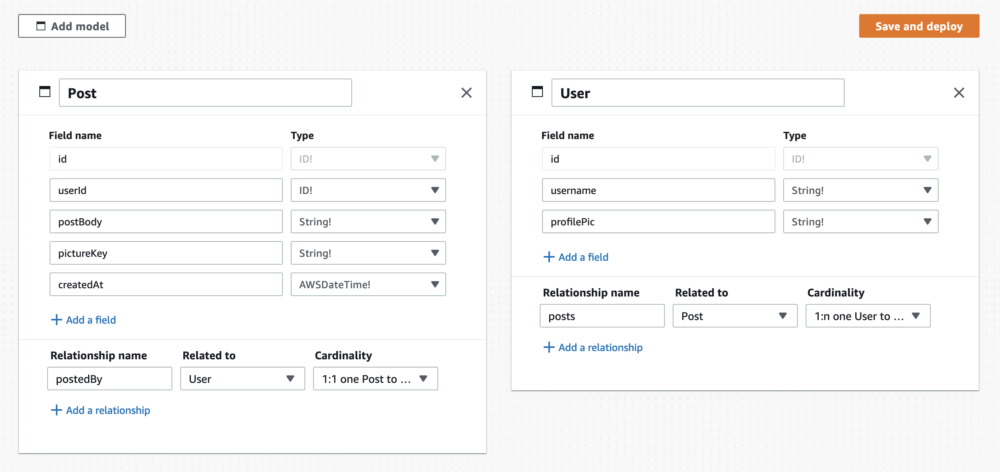
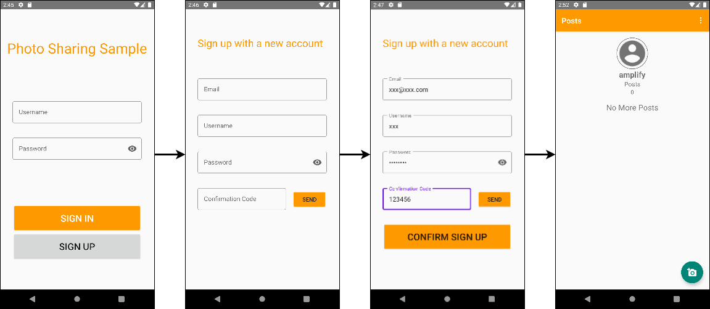
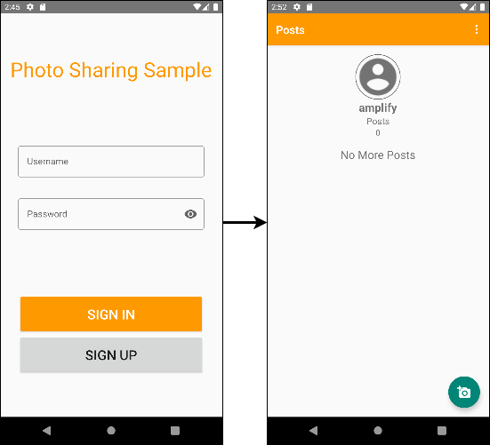
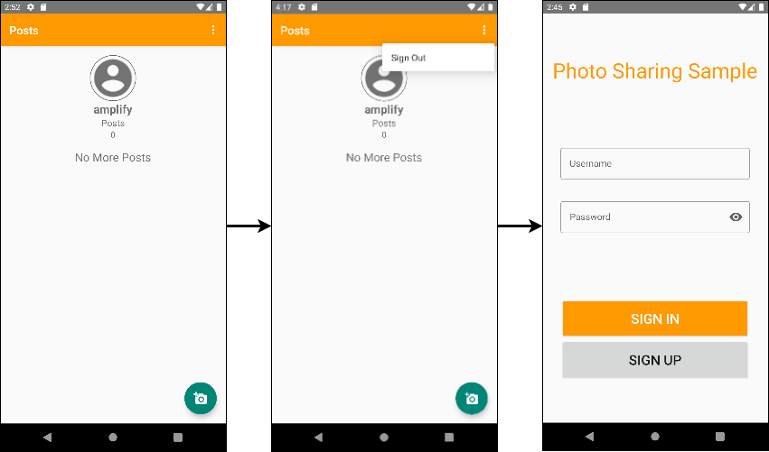
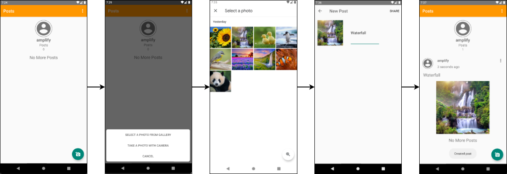
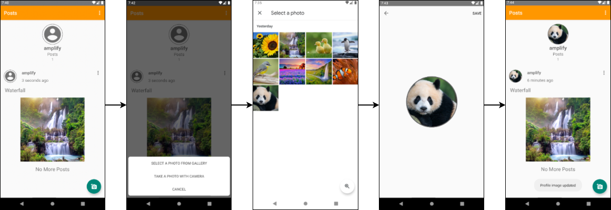
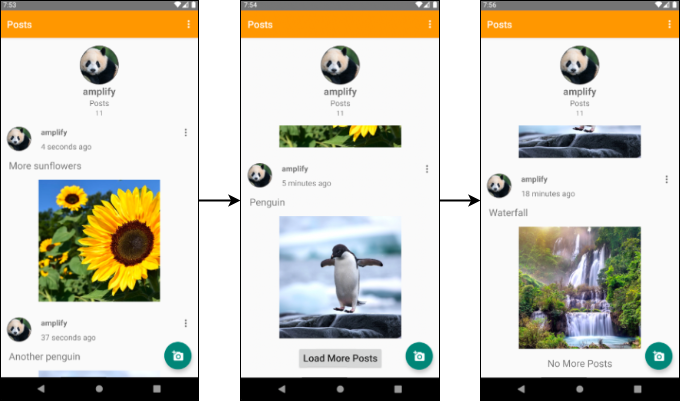
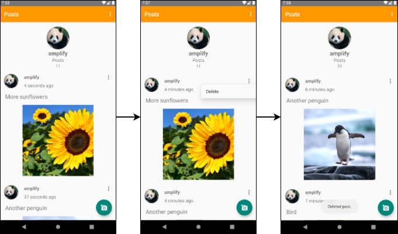

# Photo Sharing Sample App
This is a sample app to demonstrate how to build an Android App with [AWS Amplify Android libraries](https://docs.amplify.aws/lib/q/platform/android). Here, we use Kotlin as the Android programming language. We also use Kotlin Coroutines in our app.

## Run the photo sharing sample app locally

### Prerequisites
To run this sample, you need:

- [JDK 8](https://www.oracle.com/java/technologies/javase/javase8u211-later-archive-downloads.html)
- [Android Studio](https://developer.android.com/studio) 4.0+
- Android SDK 24+
- Kotlin Plugin 1.6+

### Setup the sample app
- Git clone the sample GitHub repository under your preferred directory.
```bash
git clone git@github.com:aws-amplify/amplify-android-samples.git
```
- Change directory to PhotoSharing Android Project:
```bash
cd amplify-android-samples/PhotoSharing
```
- Import the sample app as a project in Android Studio. (Be sure to `import` instead of `open`)

### Provision AWS backend resources using Amplify CLI
1. Please follow the [instructions](https://docs.amplify.aws/lib/project-setup/prereq/q/platform/android/) to sign up for an AWS Account and setup the Amplify CLI.

2. Initialize Amplify in your project by running the following command from your project directory:

```
amplify init
```
Provide the responses shown after each of the following prompts.
```
? Enter a name for the environment
    `dev`
? Choose your default editor:
    `Android Studio`
? Where is your Res directory:
    `app/src/main/res`
? Select the authentication method you want to use: 
    `AWS profile`
? Please choose the profile you want to use 
    `default`
```
Wait until provisioning is finished. Upon successfully running `amplify init`, you will see a configuration file created in `./app/src/main/res/raw/` called `amplifyconfiguration.json`. This file will be bundled into your application so that the Amplify libraries know how to reach your provisioned backend resources at runtime.

3. Configure Auth category

The Amplify Auth category provides an interface for authenticating a user and also provides the necessary authorization to other Amplify categories. It comes with default, built-in support for Amazon Cognito User Pools and Identity Pools. From your project directory, run the following command to add the Amplify Auth category:
```
amplify add auth
```
Provide the responses shown after each of the following prompts.
```
? Do you want to use the default authentication and security configuration?
    `Default configuration`
? How do you want users to be able to sign in?
    `Username`
? Do you want to configure advanced settings?
    `No, I am done.`
```

4. Configure DataStore category

From your project directory, run the following command to add the Amplify API category and create a new GraphQL API:
```
amplify add api
```
Provide the responses shown after each of the following prompts.
```
? Please select from one of the below mentioned services: 
    `GraphQL`
? Provide API name: 
    `PhotoSharingAPI`
? Choose the default authorization type for the API 
    `Amazon Cognito User Pool`
? Do you want to configure advanced settings for the GraphQL API 
    `Yes, I want to make some additional changes.`
? Configure additional auth types? 
    `No`
? Enable conflict detection? 
    `Yes`
? Select the default resolution strategy 
    `Auto Merge`
? Do you have an annotated GraphQL schema? 
    `Yes`
? Provide your schema file path: 
    `schema.graphql`
```
This will configure the Amplify API category to provision a GraphQL service with CRUD operations to persist data locally and automatically synchronize local data to the cloud with Amplify DataStore. Authorization is handled via the Cognito User Pool setup as part of the Amplify Auth configuration in step 3. The schema for our model is defined in the [`schema.graphql`](https://github.com/aws-amplify/amplify-native-samples-staging/blob/main/PhotoSharing/Android/schema.graphql) file. For more information, see the [Amplify DataStore documentation](https://docs.amplify.aws/lib/datastore/getting-started/q/platform/android/).

5. Configure Storage category

The Amplify Storage category provides an interface for managing user content for your app and comes with default, built-in support for Amazon Simple Storage Service (S3). From your project directory, run the following command to add the Amplify Storage category:
```
amplify add storage
```
Provide the responses shown after each of the following prompts.
```
? Please select from one of the below mentioned services:
    `Content (Images, audio, video, etc.)`
? Please provide a friendly name for your resource that will be used to label this category in the project:
    `default`
? Please provide bucket name:
    `default`
? Who should have access:
    `Auth users only`
? What kind of access do you want for Authenticated users?
    `create/update, read, delete`
? Do you want to add a Lambda Trigger for your S3 Bucket?
    `No`
```
This will create and configure an S3 storage bucket to store photos for the app, specify that only authenticated users can access the bucket, and grant authenticated users the ability to create, read, update, and delete the photos. For more information, see the [Amplify Storage documentation](https://docs.amplify.aws/lib/storage/getting-started/q/platform/android/).

6. Generate model files  
From your project directory, run `amplify codegen models`. This will generate model files from the GraphQL schema.

7. Once finished, run `amplify push` to publish your changes. Provide the responses shown after each of the following prompts.
```
? Are you sure you want to continue?
    `Yes`
? Do you want to generate code for your newly created GraphQL API?
    `No`
```

Upon completion, `amplifyconfiguration.json` should be updated to reference these provisioned backend resources.

### Provision AWS backend resources using Amplify Admin UI

1. Open Amplify Studio

- Sign in to the AWS Management Console and open AWS Amplify. Choose **Create app backend**.
- Enter a name for your app (i.e. PhotoSharing), and choose **Confirm deployment**. This deploys a default **staging** backend environment.
- On the application information page, choose the **Backend environments** tab.
- Choose **Launch Studio**. This automatically logs you in to the Admin UI.

If you already have an existing backend environment, you can enable the Admin UI from the console.

2. Configure Auth category

- On the **Set up** menu, choose **Auth**.
- In the Configure log in section, choose **username** as login mechanism from the **Add login** mechanism list. 
- Choose **Enforced** to require MFA for all users or choose **Optional** to allow individual users to enable MFA.
- In the **Configure sign up** section, expand **Password protection settings** and customize the password policy settings to enforce. u6. Choose **Save and Deploy**. This starts a CloudFormation deployment with the progress displayed in the upper right corner of the page.

Login mechanism settings, and sign up settings can't be changed after you deploy authentication. To change these settings, you must first delete the deployed authentication and then create and deploy new settings. You can, however, add new login mechanisms, add multi-factor authentication, and update the password protection settings.

3. Configure DataStore category

- On the **Set up** menu, choose **Data**.
- Add the following models: 

- Click **Save and deploy**

4. Configure Storage category

- On the **Set up** menu, choose **Storage**.
- Run the suggested commands from the project directory. 

5. Review backend configuration

Click **Actions** button under **Backend environments** in Amplify console, and select **View Details**, an overview of the backend configuration will show up. Details of each category can be found under the corresponding tabs.

[Admin UI setup reference link](https://docs.amplify.aws/console/adminui/start/#to-get-started-with-a-new-amplify-app)

### Run the app
- Build and run the project on an emulator or Android device in Android Studio.

## App Features

This app demonstrates the following features:
- Sign up, sign in, and sign out
- Post a photo
- Update your profile image
- View a list of your created posts

### Sign Up, Sign In, and Sign Out
This app allows you to sign up and sign in using the [`Amplify.Auth.signInWithWebUI`](https://docs.amplify.aws/lib/auth/signin_web_ui/q/platform/android/) API. The `OnBoardingActivity` and `OnBoardingViewModel` display the initial screen for the app and use the `AmplifyAuthService` to handle auth related events, including sign up, sign in, and sign out.

Sign Up Flow:  
  

Sign In Flow:  
  

Sign Out Flow:  
  

### Post a Photo
Once you are authenticated, you can create a post by selecting an image from the photo gallery or taking a photo with the camera and providing a description for the post. `ImageUtils` contains the logic for opening the photo gallery or camera and retrieving the selected image. `PostEditorActivity` and `PostEditorViewModel` handle displaying the view for creating a post. When a post is created, the post is saved to DataStore via [`Amplify.DataStore.save`](https://docs.amplify.aws/lib/datastore/data-access/q/platform/android/) and the post image is uploaded to S3 using [`Amplify.Storage.uploadInputStream`](https://docs.amplify.aws/lib/storage/upload/q/platform/android/). `AmplifyDatastoreService` and `AmplifyStorageService` handle the Amplify DataStore and Storage operations, respectively.  

  

### Update Profile Image
Besides posting an image, you can also update your profile image. After pressing your profile image circle on your profile page and selecting an image from the photo gallery or taking one with the camera, a view for confirming the new profile image is displayed. Displaying this profile image confirmation view is handled by `ConfirmImageActivity` and `ConfirmImageViewModel`. After saving the new profile image, the image is uploaded to S3 via [`Amplify.Storage.uploadInputStream`](https://docs.amplify.aws/lib/storage/upload/q/platform/android/) and the image name is saved to DataStore via [`Amplify.DataStore.save`](https://docs.amplify.aws/lib/datastore/data-access/q/platform/android/).  

  

### View Posts
`UserProfileFragment` shows your username, profile image, and number of posts. `PostListFragment` and `PostListAdapter` handle displaying the posts once they are loaded. Posts are loaded using [`Amplify.DataStore.query`](https://docs.amplify.aws/lib/datastore/data-access/q/platform/android/#query-data) and [`Amplify.Storage.getUrl`](https://docs.amplify.aws/lib/storage/download/q/platform/android/#generate-a-download-url). Initially, only the first page of posts is displayed. The next page of posts, if there is one, can be displayed by pressing the "Load More Posts" button. [DataStore pagination](https://docs.amplify.aws/lib/datastore/data-access/q/platform/android/#pagination) is used to load pages of posts. A post can also be deleted, which deletes the post from DataStore using [`Amplify.DataStore.delete`](https://docs.amplify.aws/lib/datastore/data-access/q/platform/android/#delete) and removes the post image from S3 using [`Amplify.Storage.remove`](https://docs.amplify.aws/lib/storage/remove/q/platform/android/).

Load More Posts Flow:  
  

Delete Post Flow:  

